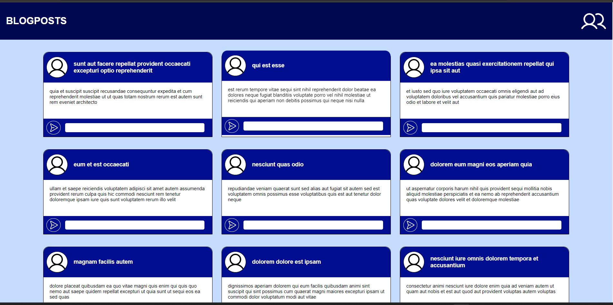
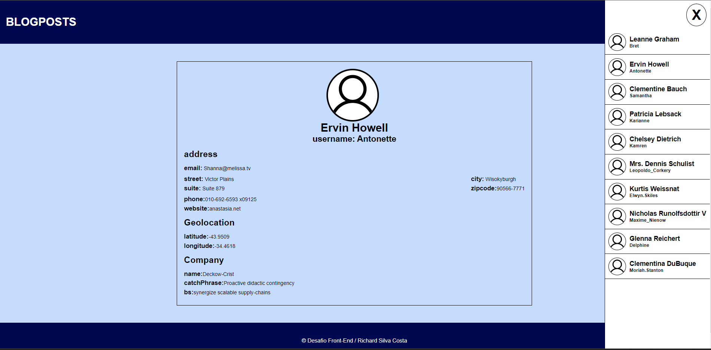

# Desafio Front End 
Nesse desafio Front End eu desenvolvi um site de Posts, com uma APIRest full
tecnologias que utliziei:
 - Angular
 - Typescript
 - HTML
 - CSS

## ⚒️ Como funciona o site
Clicando em um post você pode acessar o comentario do mesmo, clicando novamente os comentarios irão fechar,
clicando na imagem no header do lado direito o menu ira aparecer mostrando os usuarios, ao clicar 
em um dos usuarios você sera levado a outra pagina com os detalhes do usuarios selecionado, para voltar a
pagina inicial click no texto BLOGPOSTS no cabeçalho.

### Pagina Inicial

### Pagina de Detalhes usuario

